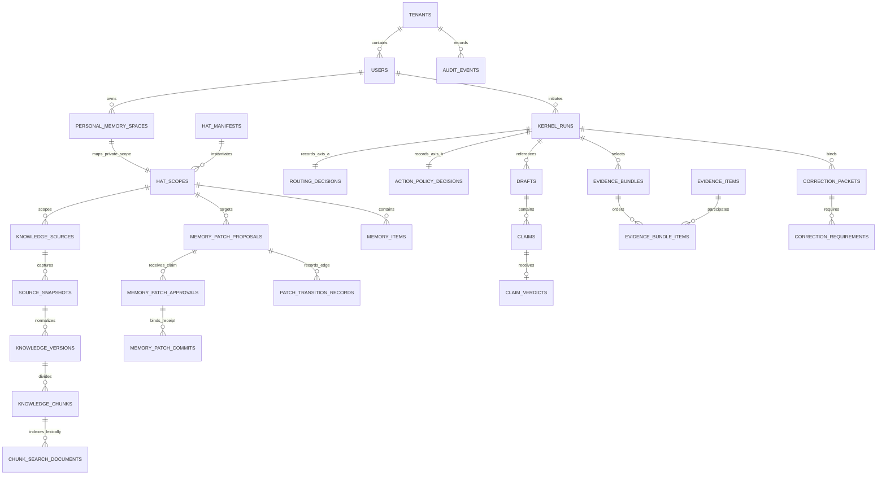

# CockroachDB Logical Schema and Migration Foundation 1A

## Status and purpose

Step 4 establishes the first durable, domain-neutral CockroachDB logical
schema for Memory Patch and a deterministic forward-only migration mechanism.
It targets the immutable Step 3 pin, CockroachDB `v26.2.4` with cluster version
`26.2`.

This is a storage structure, not an authority engine, persistence adapter,
ingestion service, or production security policy. Stored routing decisions,
approvals, commits, HAT manifests, and audit events are inspectable facts or
claims. Their existence never authorizes model execution or a protected write.

The logical schema is tenant-ready. SQL-enforced tenant isolation is not complete until Step 5.

## Canonical inputs and terminology mapping

The schema follows these repository sources:

- the Step 1 contracts in `src/aioa_memory_kernel/contracts/`;
- the Step 1 state machines in `src/aioa_memory_kernel/state_machines/`;
- the Step 2 authority closure in
  `docs/audits/STEP_2_KERNEL_CONTRACT_REAUDIT_CLOSURE_1A.md`;
- the Step 3 version pin and evidence under `config/cockroachdb/` and
  `docs/evidence/cockroachdb-v26-2/`;
- the canonical roadmap in `docs/roadmap/PRODUCTION_ROADMAP.md`.

Roadmap nouns are mapped to the contract vocabulary instead of duplicated:

- a shared Knowledge HAT is a non-authoritative `HatManifest` plus a
  tenant-scoped `SHARED_KNOWLEDGE_HAT` row in `hat_scopes`;
- a Personal Memory HAT is the contract’s `PersonalMemorySpace` plus one
  `USER_PERSONAL_HAT` row in `hat_scopes`;
- “version” means an immutable normalized state derived from one exact source
  snapshot; it does not mean approval, publication, or canonical trust;
- approval and commit rows persist the exact contract bindings but do not
  authenticate the claimed actor or consume an approval.

Session memory is deliberately not durable in this schema. The canonical
`SESSION` / `SESSION_MEMORY` values remain ephemeral contract values.

## Logical relationship



The diagram omits some composite-key columns for readability. Every
tenant-owned child carries `tenant_id`, and critical lineage foreign keys also
carry source, scope, and version identity.

## Table inventory

### Migration and identity roots

| Table | Responsibility and static safety |
|---|---|
| `memory_patch.schema_migrations` | Stable migration ID, SHA-256, application time, and runner version. The ID is the primary key. An applied checksum mismatch fails closed. No migration row is inserted before its SQL succeeds in the same explicit transaction. |
| `memory_patch.tenants` | Tenant identity root. `tenant_id` is an opaque application-supplied string primary key; display data is non-authoritative. Deletion is restricted by child foreign keys. |
| `memory_patch.users` | Tenant-scoped user identity with primary key `(tenant_id, user_id)` and an exact tenant foreign key. Display names are never security identity. |
| `memory_patch.hat_manifests` | Versioned `HatManifest` metadata. Primary key `(hat_id, hat_version)`. The schema pins version `1.0.0`, a 64-hex manifest hash, all four authority declarations to `NONE`, private-memory access to false, and user code to false. |
| `memory_patch.personal_memory_spaces` | Contract-equivalent `PersonalMemorySpace`. Primary key `(tenant_id, user_id, personal_memory_space_id)`. The owner FK is exact, canonical states are checked, and lifecycle timestamps are structurally ordered. No state default is supplied. |
| `memory_patch.personal_memory_model_bindings` | Many non-authoritative model-binding references for one exact personal-space ownership triple. A binding does not transfer ownership or permit execution. |
| `memory_patch.hat_scopes` | Unambiguous durable target scope. A row is exactly either a shared Knowledge HAT with manifest identity and no owner, or a private Personal Memory HAT with an exact tenant/user/space owner and no shared HAT identity. Composite unique keys support later RLS predicates and exact patch binding. |

### Source lineage and retrieval

| Table | Responsibility and static safety |
|---|---|
| `memory_patch.knowledge_sources` | One source registry fact attached to an exact tenant and HAT scope. Source kind, reference, observed time, and provenance remain domain-neutral. |
| `memory_patch.source_snapshots` | Immutable-byte identity for one exact source and scope. The content SHA-256 and `(tenant_id, source_id, content_sha256)` uniqueness create a future idempotency boundary. Storage references contain no credentials. |
| `memory_patch.knowledge_versions` | Ordered normalized versions of one snapshot/source/scope lineage. A composite parent FK prevents a version from changing source or HAT scope. A partial unique index permits at most one `is_current` row per tenant/source; `is_current` is not publication or trust. |
| `memory_patch.knowledge_chunks` | Retrievable text unit under one exact version/source/scope. Composite FKs prevent movement across tenant, HAT, source, or version. Ordinal and content-hash constraints make deterministic chunk identity inspectable. |
| `memory_patch.chunk_search_documents` | Explicitly configured lexical representation for one chunk. A chunk may carry `simple`, `english`, or `german` TSVECTOR rows. The inverted index is language-agnostic because the dictionary choice is stored per row. |

### Kernel evidence

| Table | Responsibility and static safety |
|---|---|
| `memory_patch.kernel_runs` | Durable `KernelRunIdentity`: exact tenant/user, optional exact Personal Memory HAT, model binding, request digest, and time bounds. It is run evidence, not permission to execute. |
| `memory_patch.routing_decisions` | Historical Axis A `RoutingDecision`, one per run. Canonical routes are checked, and an assisted/enforced route references a shared Knowledge HAT scope and manifest ID from the same tenant. It has no approval, commit, write, or authority column. |
| `memory_patch.action_policy_decisions` | Independent Axis B `ActionPolicyDecision`, one per run, with canonical policy values and non-empty reason-code JSON. Memory cannot rewrite this row through a schema side effect. |
| `memory_patch.drafts` | Immutable content reference and digest for Draft V1 or V2 (`draft_stage` 1 or 2), unique per run and stage. The database does not generate either draft. |
| `memory_patch.claims` | Contract-equivalent `ClaimCandidate` attached to a run and draft, with statement, category, and scope-dimension JSON. |
| `memory_patch.claim_verdicts` | One canonical `ClaimVerdict` per claim. A supported verdict requires at least one evidence reference. A verifier identifier is provenance, not human approval. |
| `memory_patch.evidence_items` | Exact source-version evidence reference with canonical evidence-only trust classes, content hash, citation, validity, scope, and authority rank. The rank orders source authority; it grants no write authority. |
| `memory_patch.evidence_bundles` | Run-bound ordered evidence selection tied to a shared Knowledge HAT scope and manifest ID, with canonical `EvidenceStatus`, retrieval policy version, and bundle hash. |
| `memory_patch.evidence_bundle_items` | Stable item order and uniqueness inside one evidence bundle. |
| `memory_patch.correction_packets` | Frozen `CorrectionPacket` hash, run, Draft V1, exact shared Knowledge HAT scope/manifest, route/policy/evidence state, bounded uncertainty, and canonical payload. It is input to a future Draft V2 process, never approval. |
| `memory_patch.correction_requirements` | Evidence-bound requirement rows under one packet and claim. Mandatory factual requirements require at least one evidence reference. |

### Governed memory, patch binding, and audit

| Table | Responsibility and static safety |
|---|---|
| `memory_patch.memory_patch_proposals` | Scope-bound `MemoryPatchProposal` with canonical origin, trust, content-kind, lifecycle vocabulary, payload hash, evidence, and validity. Shared and personal target shapes are mutually exclusive and tied to the exact `hat_scope`. The database does not transition it automatically. |
| `memory_patch.memory_patch_approvals` | Claimed `MemoryPatchApproval`, bound to exact tenant/proposal/content hash/target scope and, for private scope, required exact owner/space. Only `USER` or `HUMAN_REVIEWER` actor-type claims pass the static check. This does not authenticate the actor. |
| `memory_patch.memory_patch_commits` | Separate technical `MemoryPatchCommit` receipt, bound to an `APPROVE` approval proof, proposal hash, target scope, and required private owner/space where applicable. Only `COMMIT_SERVICE` or `MIGRATION_SERVICE` actor-type claims and `CRDB_TRANSACTIONAL` storage pass static checks. It does not apply or activate content. |
| `memory_patch.patch_transition_records` | Append-oriented transition fact. Its check constraint permits only edges from the canonical Step 1 graph. Actor authorization and ordering against prior facts remain application/transaction responsibilities. |
| `memory_patch.memory_items` | Governed shared or personal memory row under an exact HAT scope. Shared/personal visibility is tied to scope type. Verified memory requires a source patch and is statically forced inactive at this layer. Session memory is not persisted. |
| `memory_patch.audit_events` | Tenant-scoped immutable hash-chain fact with optional exact run or personal-space context. Payloads are represented by hashes and bounded metadata; durable append policy remains a later adapter responsibility. |

All 29 tables use primary keys. Tenant consistency is enforced with 44 live
catalog foreign-key constraints, and evidence-bearing parent rows use
`ON DELETE RESTRICT`. The schema creates no cascade deletion.

## Tenant and ownership model

`tenant_id` is present on every tenant-owned root and propagated through
dependent tables. Composite foreign keys include additional identity when a
plain tenant FK would permit a lineage swap.

`hat_scopes` removes nullable-ownership ambiguity:

- `SHARED_KNOWLEDGE_HAT` requires `knowledge_hat_id` and
  `knowledge_hat_version`; private owner fields must be null.
- `USER_PERSONAL_HAT` requires `owner_user_id` and
  `personal_memory_space_id`; shared HAT fields must be null.
- the personal triple references exactly one
  `(tenant_id, user_id, personal_memory_space_id)` row.

Consequently, a private space cannot be represented without its owner, cannot
have two owners under one primary identity, and cannot be converted into a
shared HAT by omitting a nullable owner. Shared and private source lineage both
reference the same explicit scope root without duplicating source/version/chunk
entities.

These keys are structural prerequisites for Step 5. They are not SQL-enforced
tenant access control. Step 5 must create non-admin application roles, trusted
session context, RLS, FORCE RLS where appropriate, and negative policy tests.

## Source, snapshot, version, and chunk lineage

The enforced chain is:

```text
knowledge_sources
  -> source_snapshots
    -> knowledge_versions
      -> knowledge_chunks
```

Every edge carries `tenant_id` and `hat_scope_id`; the version and chunk edges
also carry the stable source identity. Parent-version lineage must retain the
same tenant/source/scope. Content SHA-256 values identify source bytes,
normalized state, and chunk content independently. Timestamps describe when
facts were observed or persisted and never replace immutable identity.

The database protects referential identity and restrictive deletion. It does
not prevent every UPDATE by an administrative writer because that would
require Step 5 roles or forbidden workflow triggers. Step 6 must expose only
append or explicitly versioned operations for immutable evidence.

## Identifier and time policy

The Step 1 contracts define identifiers as required, non-empty strings but do
not require UUID wire values. Step 4 therefore preserves opaque
application-supplied `STRING` identifiers rather than changing the public
contract. The migration runner itself generates UUID-derived, clearly marked
test database names.

All persisted times use `TIMESTAMPTZ`. Creation, observation, retrieval,
decision, commit, update, deletion-request, and deletion-completion times are
separate columns where the contracts distinguish them. Static ordering checks
cover same-row relationships. No timestamp proves identity, approval, trust,
or uniqueness.

## Retrieval and index decisions

The live v26.2.4 catalog contains these nine explicit indexes:

- `hat_scopes_personal_owner_idx`;
- `hat_scopes_shared_hat_idx`;
- `knowledge_versions_one_current_source_idx`;
- `knowledge_chunks_scope_retrieval_idx`;
- `knowledge_chunks_content_identity_idx`;
- `chunk_search_documents_scope_idx`;
- `chunk_search_documents_vector_idx`;
- `memory_items_scope_retrieval_idx`;
- `audit_events_tenant_time_idx`.

Tenant/HAT/owner prefix columns are exact filter dimensions only. They are not
authorization.

Full text uses a separate TSVECTOR row per explicit dictionary
(`simple`, `english`, or `german`) and one inverted index. The live test
persisted an English vector and proved a deterministic match.

No VECTOR column or vector index is created. The contracts contain an optional
embedding model version but no canonical model identity or dimension. Step 3’s
three-dimensional vectors were synthetic capability fixtures, not an
application decision. Fabricating a dimension would create an incompatible
durable type, so vector DDL is deferred until a later bounded configuration
decision pins model identity and dimension. That later migration must retain
tenant/HAT prefix filters, treat them as non-security dimensions, and follow
the Step 3 vector-index backfill guard.

## Migration mechanism

The canonical manifest is
`sql/cockroachdb/migrations/manifest.json`. It fixes three ordered identities:

1. `0001_step4_identity_and_hat_scopes`;
2. `0002_step4_knowledge_lineage_and_retrieval`;
3. `0003_step4_kernel_memory_and_audit_evidence`.

Each filename equals `<migration_id>.sql`, and every SHA-256 is pinned in the
manifest. `scripts/run_cockroachdb_migrations.py` rejects undeclared files,
reordering, checksum drift, a wrong database product/version, Step 5 SQL,
authority defaults, triggers, secrets, machine paths, and domain-specific
Kernel rules.

The runner is forward-only. It applies one migration and its bookkeeping
insert in one explicit transaction. It does not claim rollback support and
does not automatically retry arbitrary migration SQL. A SQL failure aborts
the invocation and is not recorded as applied. Because a CockroachDB schema
change can be operationally expensive, each CLI execution has a bounded
timeout and later production runs must be scheduled and observed explicitly.

A repeated invocation verifies every applied checksum and returns a no-op. An
unknown applied migration or altered checksum fails closed.

## Reproducibility

Offline validation:

```bash
python3 scripts/run_cockroachdb_migrations.py --offline-validate
```

Apply to an already created loopback test database:

```bash
python3 scripts/run_cockroachdb_migrations.py \
  --apply \
  --allow-live \
  --cockroach-binary /verified/path/to/cockroach \
  --database mp_step4_explicit_test \
  --port 26257
```

Bounded disposable live validation:

```bash
python3 scripts/run_cockroachdb_migrations.py \
  --live-test \
  --allow-live \
  --cockroach-binary /verified/path/to/cockroach \
  --json-output /tmp/mp-step4-live-result.json
```

Ordinary unit-test discovery never starts CockroachDB. The live command:

- verifies the exact v26.2.4 build tag and pinned binary SHA-256;
- binds one insecure disposable node only to `127.0.0.1`;
- creates two UUID-suffixed `mp_step4_` databases;
- migrates both from zero and compares catalog digests;
- runs the first database a second time with zero pending work;
- inserts a synthetic source-to-chunk lineage and Kernel evidence;
- verifies full-text catalog/runtime behavior;
- proves expected `23503`, `23505`, and `23514` rejections;
- drops only the two recorded test databases;
- stops only its exact child PID, closes its ports, and removes its exact
  temporary store.

The committed sanitized result is
[`step4-schema-validation.json`](../evidence/cockroachdb-v26-2/step4-schema-validation.json).
No DSN, credential, dynamic port, private hostname, database store, or raw log
is committed.

## Static enforcement and future boundaries

Enforced now:

- exact tenant/user/personal-space identity paths;
- mutually exclusive shared/private HAT scope shape;
- source/snapshot/version/chunk lineage;
- canonical enum membership and schema versions;
- hash shape, timestamp ordering, and same-row invariants;
- proposal/approval/commit structural separation and digest references;
- human actor-type claims on approval rows and service actor-type claims on
  commit rows;
- canonical transition-edge shape;
- restrictive evidence deletion;
- deterministic migration identity and checksum bookkeeping.

Not enforced by Step 4:

- authenticated human identity or authorization;
- SQL role permissions, session context, RLS, FORCE RLS, or administrative
  bypass controls;
- one-time approval consumption, idempotency records, or durable transaction
  retry;
- ordering of all state changes across multiple rows;
- append-only behavior against an administrative writer;
- production distributed behavior, backup/restore policy, CDC isolation, TTL
  interaction, or operational schema-change rollout;
- persistence adapters, ingestion, S3 snapshots, embeddings, retrieval
  services, model execution, provider integration, or German-law corpus data.

Step 5 owns SQL-enforced isolation. Step 6 owns bounded persistence adapters,
idempotency, and `40001` retry behavior. The Step 3 natural client-visible
`40001` probe and combined TTL/changefeed interaction remain deferred.
