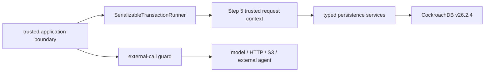

# CockroachDB Persistence, Idempotency, and Retry Foundation 1A

## Status and boundary

Step 6 adds a retry-safe persistence foundation on top of the Step 4 logical
schema and Step 5 SQL isolation boundary. CockroachDB remains the system of
record for AIOA workflow state; the pinned runtime is `v26.2.4` with cluster
version `26.2`.
Persistence rows record facts; they do not grant approval, commit, activation,
publication, evidence, model, HAT, or external-execution authority.

The production slice contains:

- one typed, driver-neutral DB-API-style connection boundary;
- one explicit `SERIALIZABLE` transaction runner;
- automatic full-transaction retry for SQLSTATE `40001` only;
- one durable operation-identity and resume table;
- compare-and-set idempotency transitions;
- representative immutable writes for kernel runs, source snapshots, evidence
  items, and audit events;
- a transaction-state guard that external-call boundaries must invoke;
- neutral composite external-reference identity for future adapters.

Step 7 S3 integration was not started. No NVIDIA, NOOA, OpenShell, model, HAT,
AWS, S3, ingestion, execution, or application-authentication integration is
implemented. Step 36 remains the dedicated production credential-hardening
step.

The Step 3 natural client-visible `40001` contention trace and combined
TTL/changefeed interaction remain deferred. Synthetic `40001` signals prove
retry control flow, not natural contention frequency.

## Dependency and connection strategy

The repository has no dependency manifest that pins a PostgreSQL driver, and
the validated Python environment contained no `psycopg`, `psycopg2`,
`pg8000`, or `asyncpg` module. Step 6 therefore does not silently install or
introduce a driver.

The package targets narrow structural protocols:

```text
ConnectionFactory
  -> ConnectionProtocol
       -> CursorProtocol
```

The factory is supplied by a future trusted application composition root. The
persistence package creates no DSN, login, password, root/admin client, or
pool. Unit tests use deterministic fake connections. Live SQL conformance
uses the already pinned full CockroachDB executable through the
repository-owned CLI harness. Production connection-factory wiring remains
outside Foundation 1A.

The factory must return mapping rows and a fresh or safely reset connection
for each transaction attempt. The future login must be authenticated outside
this package and have only the Step 5 runtime and trusted context-setter
memberships. Models, HATs, critics, and external agents never receive the
factory, cursor, DSN, or database credentials.

## Persistence architecture



The two paths are deliberately separate. External work happens only after
`assert_no_open_persistence_transaction()` succeeds. Database callbacks receive
a bounded `Transaction` facade, not the underlying connection or cursor. The
facade becomes invalid before commit or rollback returns, so retaining it
across the transaction boundary fails closed.

## Serializable transaction algorithm

Every attempt performs the entire sequence:

1. obtain one connection;
2. execute `BEGIN TRANSACTION ISOLATION LEVEL SERIALIZABLE`;
3. call the Step 5 `set_request_context` function with an exact typed tenant,
   user, and access mode;
4. run the complete transaction callback;
5. invalidate the transaction handle;
6. commit;
7. clear the local transaction marker and release the connection.

If a structured driver SQLSTATE is exactly `40001`, the runner invalidates the
handle, rolls back, clears the marker, closes the cursor and connection, then
sleeps and repeats the complete callback. It uses exactly ten maximum attempts
and an exponentially bounded backoff no greater than one second.

SQLSTATE values `23503`, `23505`, `23514`, `42501`, `22023`, `0A000`, unknown
states, configuration failures, and authentication/connection failures are
not automatically retried. Driver exception text is not exposed. Attempt,
operation kind, SQLSTATE, and a bounded sanitized code are the only diagnostic
fields.

Commit-time `40001` is handled identically to callback-time `40001`. A
rollback or release failure stops retry because connection state can no longer
be asserted safe. Process-level interruption is cleaned up and propagated,
not converted into a database success or ordinary retry.

## No external call inside a transaction

The transaction runner sets a `ContextVar` marker for the whole callback and
clears it before any retry backoff or return. The exported
`assert_no_open_persistence_transaction()` guard:

- passes outside the persistence transaction;
- fails inside the callback;
- fails in nested transaction misuse;
- is clear after commit, rollback, retry, and propagated interruption.

Future model, HTTP, AWS, S3, NVIDIA, or other external adapters must call this
guard before starting their external work. The guard is defense in depth;
code review and dependency boundaries must also keep external clients out of
transaction modules.

A future external workflow must use short phases:

```text
transaction: claim durable intent
external call: no database transaction open
transaction: bind verified result or mark explicit interruption/failure
```

A missing receipt or result is never recorded as completed success.

## Migration 0005 and durable schema

Migration
`0005_step6_persistence_idempotency_retry_foundation` adds exactly one table:
`memory_patch.persistence_operations`.

| Area | Columns or rule |
|---|---|
| Stable identity | tenant, operation ID, schema version, optional owner, operation kind, idempotency key |
| Canonical binding | request digest and scope digest |
| Resume state | status, attempt count, sanitized SQLSTATE/error code |
| Result binding | optional result reference, result digest, completion time |
| Time | created, updated, and optional completed timestamps |
| Neutral external identity | origin kind/system/version, adapter version, artifact kind, external reference |

The workflow status vocabulary is exactly `PENDING`, `IN_PROGRESS`,
`COMPLETED`, `INTERRUPTED`, and `FAILED_FINAL`. It is persistence workflow
state, not an action verdict or authority lifecycle.

Database checks require lowercase 64-hex digests, bounded canonical text,
nonnegative attempts, ordered timestamps, a complete-or-absent external tuple,
and a result digest plus completion timestamp for `COMPLETED`. Every
non-completed state must have no result reference, result digest, or completion
timestamp.

A `SECURITY INVOKER` update guard makes tenant, owner, operation, idempotency,
digest, creation, and external-reference identity immutable. It does not
authorize a state transition and performs no approval, commit, activation,
publication, or external action.

## Uniqueness and idempotency

Three partial/composite unique indexes enforce:

```text
tenant-shared:
tenant_id + operation_kind + idempotency_key

user-private:
tenant_id + owner_user_id + operation_kind + idempotency_key

external identity:
tenant_id + origin_kind + origin_system + origin_version
+ adapter_version + artifact_kind + external_ref
```

The same textual idempotency key may exist in another tenant or for another
private user. `external_ref` is never unique or trusted by itself.

`IdempotencyService` exposes:

- `begin_or_resume_operation`;
- `complete_operation`;
- `mark_operation_interrupted`;
- `mark_operation_failed_final`;
- `get_operation`.

First claim inserts one `IN_PROGRESS` operation with attempt 1. An exact
in-progress duplicate returns the existing status with `may_proceed = false`,
preventing silent duplicate external work. An exact completed duplicate
returns the same result binding. A different request digest, scope digest,
tenant/user binding, operation kind, or complete external identity raises a
typed conflict.

`INTERRUPTED` may resume only through an expected-state compare-and-set and
increments attempt count monotonically. `FAILED_FINAL` does not resume under
the same key. Completion and failure transitions require the expected
`IN_PROGRESS` status and attempt count. A stale transition updates no row and
raises a typed state conflict.

## Immutable domain writes

`CockroachPersistenceRepository` implements a representative production slice:

| Method | Step 4 table | Semantics |
|---|---|---|
| `create_kernel_run` | `kernel_runs` | exact replay returns the prior identity; conflicting request facts fail |
| `put_source_snapshot` | `source_snapshots` | exact content/lineage replay returns the prior row; digest conflict fails |
| `put_evidence_item` | `evidence_items` | exact evidence replay returns the prior row; content or lineage conflict fails |
| `append_audit_event` | `audit_events` | exact event replay is one logical append; conflicting event identity fails |

Each method first compares an existing row, then uses
`INSERT ... ON CONFLICT DO NOTHING RETURNING`, and finally resolves a possible
race by reading and comparing canonical facts. No mutable identity rebind is
used. Evidence records remain facts below canonical approval/commit authority.

## RLS, ownership, and runtime grants

The machine-checkable Step 6 record is
[`persistence-security-1a.json`](../../config/cockroachdb/persistence-security-1a.json).
Historical Step 5 evidence remains unchanged.

| Table | Access class | Tenant | User | RLS/FORCE | Policies | Owner | Runtime grants |
|---|---|---|---|---|---|---|---|
| `persistence_operations` | tenant-shared or user-private mutable workflow | `tenant_id` | `owner_user_id` when private | YES/YES | SELECT, INSERT, UPDATE | `mp_schema_owner` | SELECT, INSERT, UPDATE |

The runtime has no `DELETE`, DDL, ownership, role-management, or grant
privilege. Shared rows require an exact tenant context. Private rows require
the exact tenant and user context. Tenant-only context sees no private row.
There is no policy for `PUBLIC`, and the four fixed roles retain
`NOBYPASSRLS`, empty privileged membership, and their Step 5 ownership
separation.

Live nonadministrative probes proved cross-tenant select/insert/update denial,
same-tenant cross-user select/update denial, tenant-only private denial, and
runtime delete denial. `mp_schema_owner` saw zero rows without context under
FORCE RLS. Root/admin remained an explicitly privileged bootstrap, inspection,
fixture, and cleanup boundary and is not a runtime principal.

## Neutral external-reference prewire

An optional external reference is accepted only as the complete composite
identity documented above. It is neutral metadata and is never evidence,
approval, execution authorization, proof of execution, or proof of success.
Cross-tenant references remain distinct, and each system, version, adapter,
and artifact-kind dimension participates in collision identity.

No NVIDIA-branded table, type, class, role, dependency, SDK, cloud client,
bridge, agent run, action envelope, policy, or runtime was added. Future
framework adapters must remain outside a database transaction and cannot gain
evidence, approval, commit, or execution authority from this prewire.

## Validation

The bounded live harness used one loopback-only, insecure, single-node,
in-memory CockroachDB runtime with external I/O disabled. It applied all five
migrations from zero, verified a five-migration no-op replay, reproduced the
same schema and security digests in a second fresh database, and exercised
synthetic tenants/users through nonadministrative principals.

The validated catalog contained 31 tables in total, 28 protected tables,
three Step 6 policies, three runtime grants, one Step 6 identity trigger, and
three Step 6 unique indexes. The full Step 6 harness passed every live probe
and all 60 required scenarios across deterministic unit and live CLI
conformance transports. It removed both databases, all disposable and fixed
roles, the exact owned process, loopback listeners, and temporary runtime
without force-kill.

The local insecure transport proves SQL, catalog, RLS, FORCE RLS,
idempotency-constraint, and cleanup semantics. It does not prove production
certificates, authentication, pooling, secret storage, distributed contention
frequency, or a production Python-driver integration.

Run:

```bash
python3 scripts/run_cockroachdb_persistence_validation.py --offline-validate

python3 scripts/run_cockroachdb_persistence_validation.py \
  --live-test \
  --allow-live \
  --cockroach-binary <verified-v26.2.4-full-server> \
  --json-output <approved-external-result>
```

The tracked, path-free result is
[`step6-persistence-validation.json`](../evidence/cockroachdb-v26-2/step6-persistence-validation.json).

## Deferred production work

- Production connection-driver selection and factory/pool wiring remain
  external to Foundation 1A.
- Production authentication, certificates, secrets, and credential separation
  are not implemented; Step 36 remains dedicated hardening.
- Natural client-visible `40001` frequency remains unproven.
- Combined TTL/changefeed behavior remains deferred from Step 3.
- S3 snapshot authority, Object Lock, ingestion, reconciliation, and external
  execution receipts are later roadmap work.
- Step 7 was not started.
