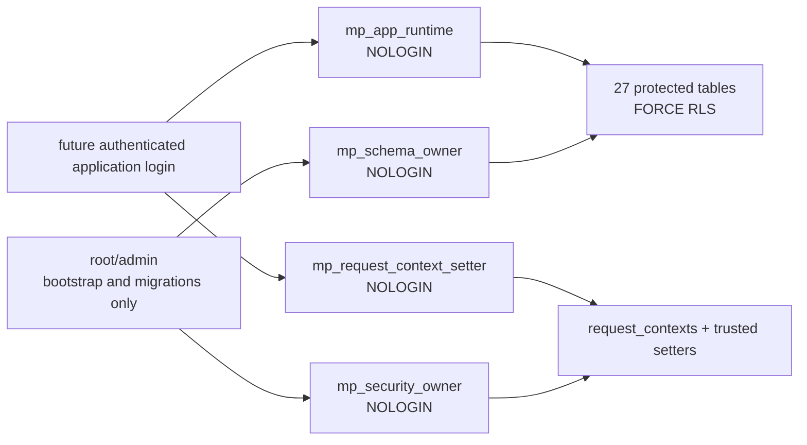

# CockroachDB Tenant Roles, Session Context and Row-Level Security 1A

## Status and boundary

Step 5 adds the SQL-enforced isolation boundary to the immutable Step 4
logical schema on CockroachDB `v26.2.4`, cluster version `26.2`. It introduces
one forward migration, four fixed `NOLOGIN` roles, transaction-bound tenant
and user context, least-privilege grants, command-specific RLS policies, and
`FORCE ROW LEVEL SECURITY`.

This boundary isolates database rows. It does not authenticate a human,
implement an API login, configure production certificates or secrets, or
grant approval, commit, activation, publication, external-action, or model
authority. Only a future authenticated trusted application boundary may hold
both runtime and context-setter membership.

Step 6 persistence adapters, idempotency, and transaction retry were not
started. Step 36 remains the dedicated production credential-hardening step.
The Step 3 natural client-visible `40001` and combined TTL/changefeed items
remain deferred.

## Role and ownership architecture



The arrows show operational use or future membership, not an inheritance
chain among the four fixed roles. Live catalog inspection proved that every
fixed role has `NOLOGIN`, `NOCREATEROLE`, `NOCREATEDB`, `NOBYPASSRLS`, no
administrative membership, and no parent role.

- `mp_schema_owner` owns the `memory_patch` schema, all 29 Step 4 tables, the
  RLS policies, and policy helper functions. It is not a runtime role.
- `mp_security_owner` owns `request_contexts` and the two trusted
  `SECURITY DEFINER` context functions. It has no table runtime role.
- `mp_app_runtime` receives only the table DML and policy-helper execution
  privileges listed in the access matrix. It owns no table and has no DDL
  privilege.
- `mp_request_context_setter` may execute only
  `set_request_context` and `clear_request_context`. It has no direct
  privilege on `request_contexts`.
- root/admin is outside the normal application path. CockroachDB administrative
  access can bypass ordinary RLS and is restricted operationally to bootstrap,
  migrations, fixture setup, catalog inspection, and cleanup.

No model, provider, HAT, Critic Prompt Loop, external agent, NVIDIA component,
approval helper, or commit helper role is created.

## Trusted request context

The context key is the stable database `session_user` plus
`pg_backend_pid()`. A row also stores `transaction_timestamp()` and therefore
matches only the transaction in which it was established.

The trusted protocol is:

1. authenticate the application request outside the database;
2. begin a short database transaction;
3. call the trusted setter with a stable canonical tenant ID and either:
   `TENANT_SHARED` with no user, or `USER_PRIVATE` with the exact user ID;
4. execute runtime DML in that transaction;
5. commit or roll back;
6. explicitly clear or replace context before any reused connection performs
   unrelated work.

The setter:

- verifies membership in `mp_request_context_setter`;
- rejects null, blank, unsupported, and inconsistent mode inputs with `22023`;
- validates tenants and tenant/user pairs through Step 4 foreign keys;
- replaces any prior row for the same principal/backend;
- uses no dynamic SQL or interpolated identifier;
- refers to database objects and built-ins with qualified names.

CockroachDB `v26.2.4` does not support the PostgreSQL-style function
`SET search_path` clause used by some `SECURITY DEFINER` designs. The migration
therefore uses fully qualified references throughout instead of claiming that
unsupported control.

Context checks are `STABLE` within a transaction. A context row from a
committed, rolled-back, failed, or logically unrelated transaction has a
different transaction timestamp and fails closed. Missing context returns
false. Tenant-only context never matches user-private policy predicates.

CockroachDB accepts caller-defined session variables such as
`SET memory_patch.tenant_id = ...`; every Step 5 policy deliberately ignores
them. The live spoof probe proved that setting such a value exposes zero rows.

This is a trusted context-setter boundary, not per-user database-principal
binding. Step 5 does not authenticate the end user and does not make an
untrusted SQL client safe merely because it can call `SET`.

## RLS decision model

- Tenant-shared row: active tenant must exactly match the row tenant.
- User-private row: active tenant and active user must both exactly match.
- HAT-scoped row: the referenced `hat_scope` must itself be visible under the
  same tenant/shared-or-private context.
- Run/evidence child: every relevant parent must be visible under the same
  context, preventing traversal through a known identifier.
- Global internal row: ordinary runtime receives only the documented immutable
  read.
- Security or migration internal row: ordinary runtime receives no access.

Each permitted `SELECT` uses `USING`; each permitted `INSERT` uses
`WITH CHECK`; permitted `UPDATE` uses both `USING` and `WITH CHECK`; permitted
`DELETE` uses `USING`. No policy is granted to `PUBLIC`, no policy is
allow-all, and no missing or null context becomes a wildcard.

Step 4 composite foreign keys continue to enforce tenant/scope lineage. Two
narrow `BEFORE UPDATE` guards prevent mutable lifecycle rows from rebinding
tenant, user, HAT scope, visibility, trust, content, evidence, or stable
identity. They do not approve, commit, activate, publish, or execute anything.

## Canonical access matrix

The machine-checkable source is
[`rls-security-1a.json`](../../config/cockroachdb/rls-security-1a.json).
The operation column is ordered `SELECT; INSERT; UPDATE; DELETE`.
`YES/YES` means RLS enabled and FORCE RLS enabled.

| Table | Access class | Tenant | User dimension | RLS/FORCE | Runtime operations | Owner | Runtime grants |
|---|---|---|---|---|---|---|---|
| `memory_patch.action_policy_decisions` | USER_PRIVATE_APPEND_ORIENTED | `tenant_id` | run → user | YES/YES | allow; allow; deny; deny | `mp_schema_owner` | INSERT, SELECT |
| `memory_patch.audit_events` | TENANT_OR_USER_APPEND_ORIENTED | `tenant_id` | `user_id` when private | YES/YES | allow; allow; deny; deny | `mp_schema_owner` | INSERT, SELECT |
| `memory_patch.chunk_search_documents` | HAT_SCOPE_APPEND_ORIENTED | `tenant_id` | scope → owner | YES/YES | allow; allow; deny; deny | `mp_schema_owner` | INSERT, SELECT |
| `memory_patch.claim_verdicts` | USER_PRIVATE_APPEND_ORIENTED | `tenant_id` | claim → run → user | YES/YES | allow; allow; deny; deny | `mp_schema_owner` | INSERT, SELECT |
| `memory_patch.claims` | USER_PRIVATE_APPEND_ORIENTED | `tenant_id` | run/draft → user | YES/YES | allow; allow; deny; deny | `mp_schema_owner` | INSERT, SELECT |
| `memory_patch.correction_packets` | USER_PRIVATE_APPEND_ORIENTED | `tenant_id` | run/draft → user | YES/YES | allow; allow; deny; deny | `mp_schema_owner` | INSERT, SELECT |
| `memory_patch.correction_requirements` | USER_PRIVATE_APPEND_ORIENTED | `tenant_id` | packet/claim → user | YES/YES | allow; allow; deny; deny | `mp_schema_owner` | INSERT, SELECT |
| `memory_patch.drafts` | USER_PRIVATE_APPEND_ORIENTED | `tenant_id` | run → user | YES/YES | allow; allow; deny; deny | `mp_schema_owner` | INSERT, SELECT |
| `memory_patch.evidence_bundle_items` | USER_PRIVATE_APPEND_ORIENTED | `tenant_id` | both parents visible | YES/YES | allow; allow; deny; deny | `mp_schema_owner` | INSERT, SELECT |
| `memory_patch.evidence_bundles` | USER_PRIVATE_APPEND_ORIENTED | `tenant_id` | run and scope visible | YES/YES | allow; allow; deny; deny | `mp_schema_owner` | INSERT, SELECT |
| `memory_patch.evidence_items` | HAT_SCOPE_APPEND_ORIENTED | `tenant_id` | scope → owner | YES/YES | allow; allow; deny; deny | `mp_schema_owner` | INSERT, SELECT |
| `memory_patch.hat_manifests` | GLOBAL_INTERNAL | — | — | NO/NO | read-only; deny; deny; deny | `mp_schema_owner` | SELECT |
| `memory_patch.hat_scopes` | HAT_SCOPE_MIXED | `tenant_id` | `owner_user_id` | YES/YES | allow; deny; deny; deny | `mp_schema_owner` | SELECT |
| `memory_patch.kernel_runs` | USER_PRIVATE_APPEND_ORIENTED | `tenant_id` | `user_id` | YES/YES | allow; allow; deny; deny | `mp_schema_owner` | INSERT, SELECT |
| `memory_patch.knowledge_chunks` | HAT_SCOPE_APPEND_ORIENTED | `tenant_id` | scope → owner | YES/YES | allow; allow; deny; deny | `mp_schema_owner` | INSERT, SELECT |
| `memory_patch.knowledge_sources` | HAT_SCOPE_APPEND_ORIENTED | `tenant_id` | scope → owner | YES/YES | allow; allow; deny; deny | `mp_schema_owner` | INSERT, SELECT |
| `memory_patch.knowledge_versions` | HAT_SCOPE_APPEND_ORIENTED | `tenant_id` | scope → owner | YES/YES | allow; allow; deny; deny | `mp_schema_owner` | INSERT, SELECT |
| `memory_patch.memory_items` | HAT_SCOPE_MIXED | `tenant_id` | scope → owner | YES/YES | allow; allow; allow guarded lifecycle fields; deny | `mp_schema_owner` | INSERT, SELECT, UPDATE |
| `memory_patch.memory_patch_approvals` | HAT_SCOPE_APPEND_ORIENTED | `tenant_id` | `owner_user_id` | YES/YES | read-only; deny; deny; deny | `mp_schema_owner` | SELECT |
| `memory_patch.memory_patch_commits` | HAT_SCOPE_APPEND_ORIENTED | `tenant_id` | `owner_user_id` | YES/YES | read-only; deny; deny; deny | `mp_schema_owner` | SELECT |
| `memory_patch.memory_patch_proposals` | HAT_SCOPE_MIXED | `tenant_id` | `owner_user_id` | YES/YES | read-only; deny; deny; deny | `mp_schema_owner` | SELECT |
| `memory_patch.patch_transition_records` | HAT_SCOPE_APPEND_ORIENTED | `tenant_id` | proposal → owner | YES/YES | read-only; deny; deny; deny | `mp_schema_owner` | SELECT |
| `memory_patch.personal_memory_model_bindings` | USER_PRIVATE | `tenant_id` | `user_id` | YES/YES | allow; allow; deny; allow | `mp_schema_owner` | DELETE, INSERT, SELECT |
| `memory_patch.personal_memory_spaces` | USER_PRIVATE | `tenant_id` | `user_id` | YES/YES | allow; allow; allow guarded lifecycle fields; stateful deletion only | `mp_schema_owner` | INSERT, SELECT, UPDATE |
| `memory_patch.routing_decisions` | USER_PRIVATE_APPEND_ORIENTED | `tenant_id` | run → user | YES/YES | allow; allow; deny; deny | `mp_schema_owner` | INSERT, SELECT |
| `memory_patch.schema_migrations` | MIGRATION_INTERNAL | — | — | NO/NO | deny; deny; deny; deny | `mp_schema_owner` | none |
| `memory_patch.source_snapshots` | HAT_SCOPE_APPEND_ORIENTED | `tenant_id` | scope → owner | YES/YES | allow; allow; deny; deny | `mp_schema_owner` | INSERT, SELECT |
| `memory_patch.tenants` | TENANT_SHARED | `tenant_id` | — | YES/YES | allow; deny; deny; deny | `mp_schema_owner` | SELECT |
| `memory_patch.users` | USER_PRIVATE | `tenant_id` | `user_id` | YES/YES | allow; deny; deny; deny | `mp_schema_owner` | SELECT |

The additional `memory_patch.request_contexts` table is
`SECURITY_INTERNAL`, owned by `mp_security_owner`, has no ordinary runtime
grant, and intentionally has no RLS. Its only access path is through
fully-qualified trusted functions. `schema_migrations` is bookkeeping, not
tenant runtime data. `hat_manifests` is genuinely global, authority-inert
definition metadata and is immutable to runtime.

The manifest records every deterministic policy name and the exact operation,
grant, owner, append/mutability model, exception, tenant column, and direct or
resolved user dimension. Offline validation fails if any Step 4 table is
missing or appears twice.

## Privileges and defaults

The migration revokes `PUBLIC` schema, table, sequence, and function access
before granting exact privileges. Runtime cannot create, alter, drop, own, or
grant database objects; read or modify migration/context tables; execute the
trusted setter without membership; switch into an owner; or alter roles and
policies. Default table, sequence, and function privileges revoke `PUBLIC`
access for future objects in the schema.

The normal runtime has 51 exact table grants across 28 visible tables. It has
no `TRUNCATE`, `REFERENCES`, `TRIGGER`, DDL, role-management, database-create,
schema-create, or grant option.

## Migration behavior

`0004_step5_tenant_roles_session_context_rls` follows the three immutable Step
4 migrations. Cluster roles are cluster-scoped and cannot be made part of a
claimed all-or-nothing database transaction. Their creation is idempotent and
may outlive a later failed database phase.

CockroachDB permits at most a bounded number of concurrent schema changes in
one transaction. The database DDL is therefore split into nine explicit,
idempotent phases:

1. context table and functions;
2. table ownership;
3. function ownership and identity triggers;
4. grants, revokes, and default privileges;
5. first bounded RLS and FORCE RLS group;
6. second bounded RLS and FORCE RLS group;
7. first bounded command-policy group;
8. second bounded command-policy group;
9. final bounded command-policy group and context-table metadata.

The runner validates owners, role options, memberships, RLS/FORCE flags,
exact policies, grants, and identity triggers before it records migration
`0004`. A failed phase is never falsely recorded as applied. A successful
second run verifies all four checksums and performs no migration work.

## Live validation

The bounded harness is:

```bash
python3 scripts/run_cockroachdb_rls_validation.py \
  --live-test \
  --allow-live \
  --cockroach-binary <verified-v26.2.4-full-server> \
  --json-output <approved-external-result>
```

The verified run used one loopback-only, single-node, in-memory CockroachDB
server and two fresh databases. It observed:

- exact build tag `v26.2.4`, build commit
  `80586181eb50e380e2cc982f61841eaf38af9982`, and cluster version `26.2`;
- four migrations from zero, four-migration checksum no-op, and identical
  second-database security digest;
- 27 protected tables, 50 policies, 51 runtime grants, 2 identity guards;
- 95/95 probes passed: 12 positive, 16 cross-tenant, 17 cross-user,
  20 context, 7 FORCE/owner, 21 escalation, plus migration and coverage;
- every protected table had synthetic root data and returned zero rows to an
  unset-context runtime session;
- both disposable databases and all disposable/fixed roles were removed;
- the exact owned process exited gracefully, all ports closed, and the
  temporary store was removed without force-kill.

The local test intentionally used insecure transport on `127.0.0.1`. It proves
SQL-principal, grant, context, policy, RLS, FORCE RLS, and denial semantics. It
does not prove production certificates, network authentication, SSO, secret
storage, or distributed production behavior.

## Explicit non-RLS boundaries

RLS does not constrain root/admin operational authority and must not be used as
the only control for migrations, backup/restore, replication, constraints,
`TRUNCATE`, or changefeeds. Changefeed output is not claimed to be
tenant-filtered by RLS.

Foreign keys and query filters are defense-in-depth, not replacements for RLS.
`external_ref` values remain inert tenant-bound data and never authorize
access. Framework-neutral extension points are preserved; no NVIDIA-branded
role, table, policy, dependency, OpenShell policy, CandidateActionEnvelope, or
execution receipt is introduced.
