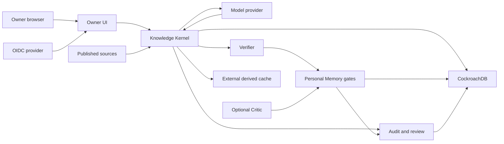

# Memory Patch for AIOA Threat Model

## Executive summary

The highest-impact risks are cross-tenant or cross-owner Personal Memory
access, corruption of canonical evidence authority, and bypass of explicit
owner approval/technical commit boundaries. The most exposed code is the OIDC
owner workspace and its database context propagation; the most integrity-
critical code is the source-to-Verified-Answer path and Steps 27-34 authority
state machines. Existing typed contracts, FORCE RLS, purpose-bound credentials,
strict model/Critic non-authority, and hash-bound receipts materially reduce
likelihood. Step 41 adds bounded Host/OIDC/return-path/body-parser hardening,
including strict bounded OIDC JSON, and validates the remaining controls
without adding authority.

## Scope and assumptions

In scope:

- `src/aioa_memory_kernel/`, including routing, evidence, model adapters,
  verification, Personal Memory, audit/review, UI, Critic, and runtime guards;
- CockroachDB migrations under `sql/cockroachdb/migrations/`;
- repository configuration under `config/`;
- controlled validators under `scripts/` and security regressions under
  `tests/`;
- the constrained Step 40 demo profile and its hosted-provider, remote-DB, and
  external-volume boundaries.

Out of scope: AWS production deployment, a production HA database claim,
production secret rotation, external penetration testing/certification,
Step 42 RC/backup/restore, and unrelated repositories.

The detailed Step 41 prompt and repository provide enough context to continue
without an additional blocking clarification. Assumptions that affect ranking:

- the owner workspace may be internet reachable through a TLS-terminating
  deployment and must therefore treat all HTTP input as hostile;
- the application is multi-tenant and Personal Memory content is private,
  user-sensitive data;
- the constrained profile uses a remote CockroachDB and hosted model provider;
- operator/migrator access is separately controlled outside browser/runtime
  processes;
- a durable production session-store implementation is deployment-owned; the
  in-process store is only for local and controlled use.

Open questions that could change ranking are the final production edge/rate-
limiting layer, user scale, identity-provider operational controls, and remote
database network policy. These do not change the Step 41 code-level acceptance
criteria.

## System model

### Primary components

- FastAPI/Jinja2/HTMX owner UI and server-side OIDC/session boundary
  (`src/aioa_memory_kernel/personal_memory_ui/web.py::create_personal_memory_app`,
  `personal_memory_ui/auth.py::HttpxOidcClient`).
- Knowledge Kernel routing, retrieval, evidence, temporal, correction, and
  verification (`routing/`, `retrieval/`, `evidence/`, `temporal/`,
  `verification/`).
- Personal Memory candidate-to-lifecycle services (`personal_memory/`).
- Append-only audit ledger and human review workspace (`audit_ledger/`,
  `review/`).
- Optional Critic candidate bridge (`critic/`).
- Purpose-bound model provider and persistence adapters (`modeling/`,
  `persistence/`, `security/credentials.py`).
- CockroachDB schema, roles, FORCE RLS, and capability functions
  (`sql/cockroachdb/migrations/`).
- Step 40 resource profile, lazy E5 runtime, pressure guard, and external
  derived cache (`runtime/`, `config/runtime/4gb-demo-1a.json`).

### Data flows and trust boundaries

- Browser -> owner UI: query/path/form/cookie data over HTTPS; configured Host,
  exactly one OIDC callback code/state pair, authenticated server session,
  CSRF, strict body/field bounds, Jinja autoescape, and CSP apply.
- Identity provider -> OIDC client: discovery, authorization code, ID token,
  and JWKS over HTTPS; redirect origin/path, issuer, signature, key identity,
  algorithm, audience, nonce, expiry, and owner claims are validated.
- Owner UI/Kernel -> CockroachDB: typed commands and parameterized SQL under a
  purpose-bound principal and request context; FORCE RLS enforces tenant/owner
  visibility.
- Source acquisition/publication -> Source Registry/HAT: content and lineage
  enter through separate ingestion/publication authority and immutable hashes.
- Kernel -> model provider: bounded prompt/request over HTTPS using only the
  provider capability; tools, web, code execution, and function calling are
  disabled; response identity and hashes are verified.
- Evidence/claims -> verifier -> Verified Answer: typed evidence, temporal
  result, Correction Packet, claim links, and deterministic checks cross only
  after canonical hash verification.
- Verified correction -> Personal Memory: Step 28 candidate, Step 29 evidence
  validation, Step 30 explicit owner approval, technical commit/activation,
  and Step 31 ACTIVE-only retrieval are distinct authority boundaries.
- Business services -> audit/review: hash-only typed facts append to an owner-
  scoped chain; review receives minimum-disclosure cases and emits typed
  handoff, not arbitrary mutation.
- Critic provider -> Critic parser -> Step 28: untrusted strict JSON can become
  at most a DETECTED candidate; unknown references and authority fields reject.
- Runtime -> external volume: derived model/cache artifacts use a verified
  external mount; canonical evidence is not evicted as cache.

#### Diagram

## Assets and security objectives

| Asset | Why it matters | Security objective (C/I/A) |
|---|---|---|
| Tenant and owner identity | Defines every private-data and approval boundary | C, I |
| Personal Memory content and lifecycle | Private personalization and user decisions | C, I, A |
| Canonical source/evidence lineage | Determines factual authority and Verified Answer eligibility | I, A |
| Approval, commit, activation receipts | Prevent state skips and forged memory activation | I |
| Database roles and request context | Enforce tenant/owner and capability isolation | C, I |
| Provider/OIDC/database credentials | Compromise could expose data or invoke privileged services | C, I |
| Audit chain and review handoff | Supports tamper evidence and accountable decisions | I, A |
| Model/Critic request and response hashes | Bind untrusted inference to exact bounded inputs | I |
| 4 GB runtime availability | Resource exhaustion must not cause security bypass | A, I |
| Repository configs/migrations/evidence | Define reproducible controls and closure claims | I |

## Attacker model

### Capabilities

- Send arbitrary browser requests, Host/origin headers, paths, query values,
  URL-encoded bodies, cookies, IDs, Unicode, and oversized inputs.
- Control ordinary owner-visible content and attempt to guess another tenant
  or owner's identifiers.
- Influence source/model/Critic text and embed prompt instructions, fake
  evidence references, URLs, authority claims, SQL-shaped strings, or markup.
- Replay stale/idempotency values and race normal owner/service operations.
- Cause bounded provider, network, database, external-volume, process, and
  acknowledgement failures in the controlled failure model.

### Non-capabilities

- No assumed access to migrator/root credentials, host root, production secret
  stores, TLS private keys, or the trusted identity-provider signing key.
- No assumed ability to alter a published source or repository commit without
  breaking its verified hash/lineage.
- Model and Critic output is not authenticated human or service authority.
- Production AWS and unrelated external systems are outside this campaign.

## Entry points and attack surfaces

| Surface | How reached | Trust boundary | Notes | Evidence (repo path / symbol) |
|---|---|---|---|---|
| OIDC login/callback | HTTP GET | Browser/IdP -> UI | State, nonce, PKCE, signature, callback binding | `personal_memory_ui/auth.py::HttpxOidcClient`; `web.py::oidc_callback` |
| Owner mutations | HTTP POST | Browser -> UI/services | Host, session, CSRF, streamed form bounds, typed backend | `personal_memory_ui/web.py::require_csrf` |
| Owner reads/exports | HTTP GET or typed command | UI -> CockroachDB | Server-derived principal, parameters, USER_PRIVATE RLS | `personal_memory_ui/backend.py::PersonalMemoryUiReadRepository` |
| Route/retrieval | Kernel request | User/model input -> source selection | HAT, tenant, publication, access and lineage filters | `routing/`; `retrieval/service.py` |
| Source publication | Worker operation | Ingestion -> canonical registry | Separate publication capability and immutable identity | `source_registry/`; migration 0018 |
| Provider response | HTTPS JSON | Provider -> Kernel | Pinned identity, bounded response, no tools | `modeling/providers/openrouter.py` |
| Correction Packet | Typed object | Claims/evidence -> verifier | Canonical hash and evidence-universe binding | `correction/`; `verification/` |
| Personal Memory candidate/lifecycle | Typed service calls | Model/Kernel/owner -> private state | Step 28/29/30 boundaries and exact owner/slot binding | `personal_memory/candidate_service.py`; `proposal_service.py`; `lifecycle_service.py` |
| Audit append/export | Typed service calls | Business service -> ledger/owner | Append-only chain, redaction, bounded proof | `audit_ledger/service.py`; `audit_ledger/export.py` |
| Review queue/handoff | Typed service calls | Service/reviewer -> downstream | Separate reviewer identity and TOCTOU checks | `review/` |
| Critic parser/bridge | Provider JSON | Untrusted Critic -> Step 28 | Closed schema and zero-authority mapping | `critic/parser.py`; `critic/bridge.py` |
| Runtime profile/pressure | Local config and host metrics | Operator/host -> runtime | Strict digest, bounded queues, fail-closed backpressure | `runtime/resource_profile.py`; `runtime/resource_guard.py` |

## Top abuse paths

1. Attacker forges owner/tenant IDs in a slot URL or form -> UI ignores client
   identity and uses the verified session -> backend/RLS deny the foreign row ->
   private data remains unavailable.
2. Attacker supplies a hostile Host or OIDC return URL -> trusted-host and
   exact callback/local-path validation reject it -> no credential or session
   redirect to attacker infrastructure.
3. Malicious source/model text instructs the model to ignore evidence -> text
   remains untrusted data -> evidence universe, temporal result, packet hashes,
   deterministic verifier, and Verified Answer gate prevent promotion.
4. Model/Critic asks to approve and activate a private patch -> strict output
   parsing allows at most a DETECTED candidate -> Step 29 validation and Step
   30 human approval remain mandatory.
5. Attacker replays or changes approval/commit inputs -> idempotency and exact
   proposal/state/content hashes detect conflict -> no duplicate or altered
   ACTIVE patch.
6. Restricted DB principal supplies a foreign tenant/owner context -> FORCE RLS
   and role membership checks deny read/write -> no scope widening.
7. Attacker alters audit history or review inputs -> chain verification or
   handoff TOCTOU checks fail -> no silent repair or downstream authority.
8. Resource pressure targets Critic/embedding/export work -> pressure guard
   rejects optional/heavy work first -> verifier, RLS, audit, and owner approval
   remain enabled.
9. Compromised runtime attempts broad credential fallback -> purpose-bound
   loader has no admin/master fallback -> operation fails closed.

## Threat model table

| Threat ID | Threat source | Prerequisites | Threat action | Impact | Impacted assets | Existing controls (evidence) | Gaps | Recommended mitigations | Detection ideas | Likelihood | Impact severity | Priority |
|---|---|---|---|---|---|---|---|---|---|---|---|---|
| TM-001 | Authenticated malicious owner | Valid account and guessed IDs | Read or mutate another owner/tenant's memory | Private-data disclosure or unauthorized lifecycle change | Identity, Personal Memory | Server principal, typed ownership, FORCE RLS (`web.py`, migrations 0004/0011-0018) | Remote deployment/network policy not frozen | Preserve per-request context; continuously run cross-owner/tenant live probes | Alert on RLS denials and repeated foreign-ID requests | low | high | high |
| TM-002 | Remote unauthenticated attacker | Internet-reachable UI | Host/redirect/state/session manipulation | Session theft or login redirection | Identity, sessions | Exact trusted Host, callback origin/path, PKCE/state/nonce/signature, secure cookies (`auth.py`, `web.py`) | Production edge/rate limit unknown | Freeze edge proxy Host/TLS policy and durable session store before production | Monitor callback/state failures and invalid Host counts | low | high | high |
| TM-003 | Malicious source/user/model text | Text reaches retrieval or inference | Invent evidence, override temporal rules, or force known-bad answer | Canonical factual integrity loss | Evidence, Verified Answer | Publication/authority filters, evidence universe, temporal resolver, packet/verifier hashes (`retrieval/`, `evidence/`, `verification/`) | External source publisher operations remain deployment-sensitive | Preserve independent publication identity and regression corpus attacks | Audit rejected evidence IDs and verifier fail-closed reasons | low | high | high |
| TM-004 | Model, browser, reviewer, or service confusion | Access to a pre-approval object | Skip Personal Memory validation/approval/commit stages | Unauthorized private memory activation | PM lifecycle, receipts | Closed states, human owner approval, narrow Commit Helper, TOCTOU hashes (`personal_memory/`) | Operator misuse remains out of process | Keep credentials non-composed and state transitions non-generic | Alert on invalid transition and stale-hash frequency | low | high | high |
| TM-005 | Model or Critic prompt injection | Attacker text included in bounded context | Claim route/source/reviewer/approval/tool authority | Authority escalation or false evidence | Provider hashes, evidence, PM | Strict schemas, reference validation, tools/web/code disabled, candidate-only Critic (`modeling/`, `critic/`) | Hosted provider is a trusted transport boundary | Keep exact provider identity and parser reconstruction checks | Count invalid fields, unknown refs, identity mismatches | medium | medium | medium |
| TM-006 | Compromised client/error path | Secret accessible to a process | Expose a key in UI, logs, evidence, export, or exception | Credential theft and follow-on access | Credentials, private data | Purpose-bound loaders, minimal child env, shared redaction, sentinel scans (`security/credentials.py`, `security/redaction.py`) | No external secret scanner in approved toolchain | Add deployment secret scanner/rotation drill in a later authorized step | Alert on redaction failures; scan release artifacts | low | high | high |
| TM-007 | Malicious reviewer/service or DB tamper | Ability to alter ledger/case data | Rewrite history or hand off stale review | Loss of accountability or unauthorized downstream decision | Audit, review | Append-only chain, typed actor/subject, separate roles, TOCTOU handoff (`audit_ledger/`, `review/`) | Migrator can alter DB by design | Restrict and monitor migrator use; retain independent exports | Verify chains on export and alert on sequence/hash failure | low | high | high |
| TM-008 | Remote user or failing dependency | Repeated heavy requests or low memory | Exhaust queues/RAM or induce unsafe degradation | Availability loss, possible skipped control if flawed | Runtime availability and integrity | Step40 one worker/lazy E5/bounded queues/pressure order (`runtime/`, 4 GB profile) | Production rate limit and remote DB latency unknown | Add edge limits and production metrics without changing semantic gates | Alert on pressure rejections, queue depth, RSS, DB saturation | medium | medium | medium |
| TM-009 | Dependency/supply-chain adversary | Vulnerable or replaced pinned package/artifact | Execute or subvert UI/model/runtime code | Broad confidentiality/integrity loss | Runtime, credentials, build artifacts | Exact pins, vendored HTMX hash, E5 and Cockroach binary identity, no remote model code | No installed vulnerability-DB scanner or JS lock | Add approved offline SBOM/vulnerability workflow before release if Step42 authorizes it | Verify package/artifact digests in CI and release | medium | high | high |
| TM-010 | Privileged operator | Migrator/root capability | Bypass RLS or alter canonical/private state | System-wide compromise | All DB assets | Migrator explicitly operations-only and absent from runtime fallback (`STEP36_CREDENTIAL_CAPABILITY_MATRIX_1A.md`) | Host/operator controls are outside repository | Enforce audited just-in-time operator access and separation of duties | Alert on migrator login and DDL outside maintenance | low | high | high |

## Criticality calibration

- Critical: remotely exploitable pre-auth code execution; broad runtime secret
  theft leading directly to database/migrator power; or a reliable cross-
  tenant read/write bypass with no existing guard. No such condition remains
  observed in Step 41.
- High: cross-owner memory exposure, canonical evidence corruption, forged
  owner approval/activation, signing/session-key compromise, or undetected
  audit tamper. Likelihood may be low because multiple independent controls
  exist, but impact remains high.
- Medium: bounded availability loss, Critic/provider diagnostic manipulation
  that cannot cross authority gates, or targeted disclosure of non-secret
  metadata. Recovery/backpressure normally contains these.
- Low: noisy invalid-input errors, local test-only denial of service, or
  low-sensitivity operational detail requiring authenticated/local access and
  producing no authority or privacy effect.

Risk rankings assume the production edge preserves HTTPS/Host semantics and
runtime principals do not receive the migrator capability.

## Focus paths for security review

| Path | Why it matters | Related Threat IDs |
|---|---|---|
| `src/aioa_memory_kernel/personal_memory_ui/auth.py` | OIDC, owner identity, opaque sessions, redirect validation | TM-001, TM-002, TM-006 |
| `src/aioa_memory_kernel/personal_memory_ui/web.py` | HTTP entry points, Host, CSRF, bounds, cookies, rendering | TM-001, TM-002, TM-008 |
| `src/aioa_memory_kernel/persistence/` | Request context and transaction/RLS propagation | TM-001, TM-004, TM-007 |
| `sql/cockroachdb/migrations/` | Roles, grants, FORCE RLS, append-only triggers | TM-001, TM-004, TM-007, TM-010 |
| `src/aioa_memory_kernel/modeling/providers/openrouter.py` | External provider identity, errors, response/tool rejection | TM-003, TM-005, TM-006 |
| `src/aioa_memory_kernel/retrieval/` | Hard source/tenant/publication filters | TM-003 |
| `src/aioa_memory_kernel/evidence/` | Evidence-universe and canonical hash authority | TM-003 |
| `src/aioa_memory_kernel/verification/` | Deterministic and semantic final-answer gates | TM-003, TM-005 |
| `src/aioa_memory_kernel/personal_memory/` | Owner slots and proposal/approval/commit/activation lifecycle | TM-001, TM-004 |
| `src/aioa_memory_kernel/audit_ledger/` | Append-only hash chain and redacted export | TM-006, TM-007 |
| `src/aioa_memory_kernel/review/` | Reviewer identity, visibility, and TOCTOU handoff | TM-004, TM-007 |
| `src/aioa_memory_kernel/critic/` | Untrusted provider output and candidate-only mapping | TM-005 |
| `src/aioa_memory_kernel/security/credentials.py` | Purpose-bound loading and no broad fallback | TM-006, TM-010 |
| `src/aioa_memory_kernel/security/redaction.py` | Secret-shaped output and evidence protection | TM-006 |
| `src/aioa_memory_kernel/runtime/` | 4 GB bounds and fail-closed pressure behavior | TM-008 |
| `config/runtime/4gb-demo-1a.json` | Frozen process/pool/queue/resource posture | TM-008 |

## Quality check

- Covered all discovered runtime entry points: OIDC/UI, retrieval/source,
  provider, correction/verifier, Personal Memory, audit/review, Critic,
  persistence, and resource profile.
- Represented every listed trust boundary in at least one abuse path and threat.
- Separated runtime behavior from controlled validators and test-only adapters.
- Used the Step 41 prompt's explicit deployment/security context; remaining
  production-edge and scale assumptions are called out rather than invented.
- Identified conditional gaps without weakening current closure gates.

Step 42 RC freeze, backup, and restore are explicitly outside this threat model
and remain NOT STARTED.
